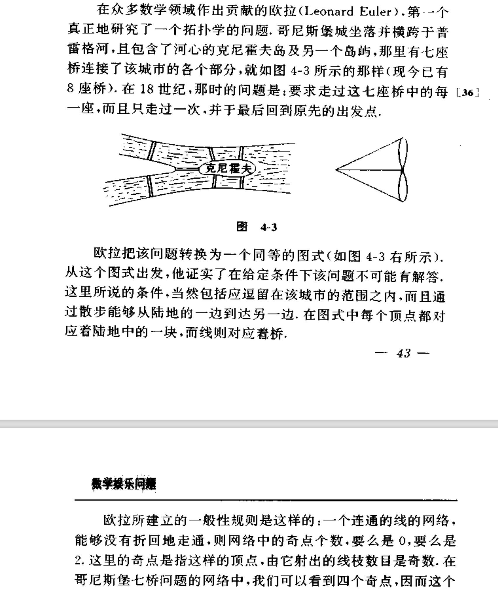
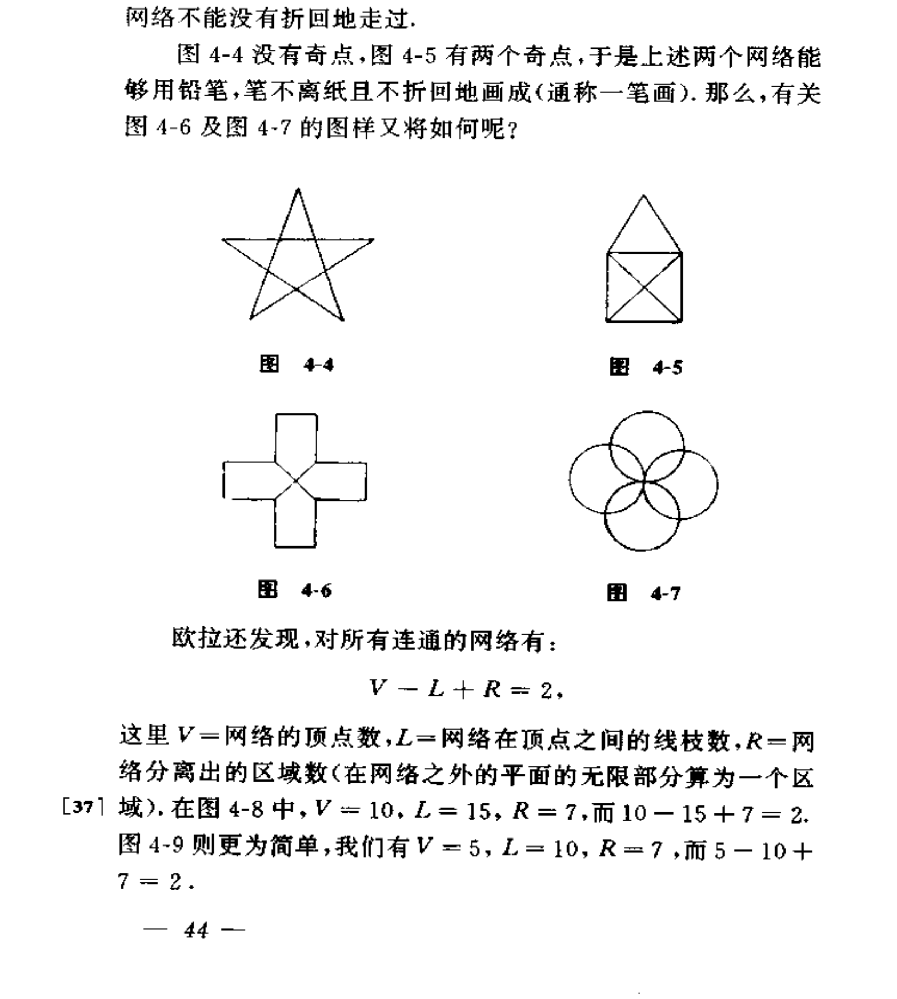
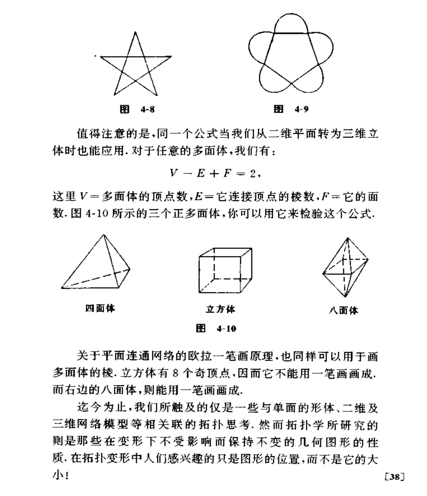

# 哥（柯）尼斯堡桥

## 问题描述

&emsp;&emsp;图片截取自《通俗数学名著译丛03-数学娱乐问题》 
## 欧拉的一些成果
+ 奇顶点的数目要么是0，要么是2。
+ V-L+R=2
## 我们的目的
&emsp;&emsp;代码判断任意给定的‘桥’能否一笔画 
## 我的思路

&emsp;&emsp;1、将所有点视作[a1,a2,.....,an],用n * n表格记录点与点之间的‘桥’数。 

&emsp;&emsp;2、从某一点开始，遍历所有可能，探测是否能够一笔画。 

&emsp;&emsp;3、如果可以，输出一笔画的路径。 

&emsp;&emsp;4、同时，我们注意到，使用欧拉的第一个结论可以帮我们过滤大量样本，提高算法效率。

